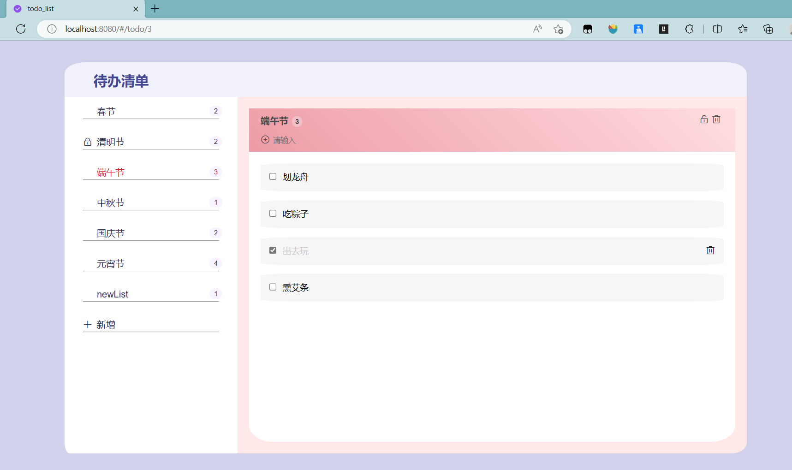

# vue-express-todo_list

## 项目介绍
本项目是 vue2+express+MySQL 搭建的前后端分离项目，实现了待办的功能，通过此项目能帮助大家快速上手 vue.js 和 express。

本项目用到的技术栈：vue2、vue-router、vuex、element-ui、axios、express、MySQL等。

## 项目运行截图


## 项目运行
```
//前端项目运行
## 下载依赖
npm install
## 本地运行  Local: http://localhost:8080/
npm run serve
## 打包
npm run build

//后端项目运行
## 项目结构中的 server 文件夹是使用node.js的 express 框架编写的后端程序。在 sever 目录下打开 Terminal 
## 下载依赖
npm install
## 本地运行
nodemon main.js
```
当然项目能成功跑起来的前提是创建了对应的数据库，这一点我会在后续的教程中告诉大家的。所以请跟着我一起学下去吧☕


